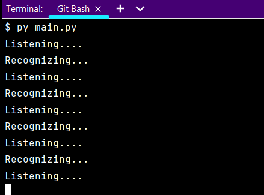

# J.A.R.V.I.S BOT IN PYTHON

# INTRODUCTION
Do you remember J.A.R.V.I.S., Tony Stark's virtual personal assistant?

If you've seen any of the Ironman or Avengers movies, I'm sure you do.

The bot is built to assist you(user) to do simple tasks by simply speaking


# LANGUAGES USED TO DEVELOP THE BOT

The Jarvis bot is built entirely using [Python](https://python.org)

Modules and libraries used are:
- Pyttsx3
- SpeechRecognition
- PyWhatKit
- Wikipedia
- Requests
- Python-decouple

# GET STARTED
Preferably, use the Git Bash terminal on Visual Studio Code


We start by creating a virtual environment ```virtualenv```:
```
$ python -m venv env
```
Activate the virtual environment:
```
$ . env/Scripts/activate
```
Once you activate the ```virtual environment```, you are set to get started by installing libraries needed to run the bot
- PYTTSX3. A text to speech library that works offline
```
pip install pyttsx3
```
- SPEECH RECOGNITION. Converts audio into text
```
$ pip install SpeechRecognition
```
- PYWHATKIT. Enables easy interaction with the browser
```
pip install pywhatkit
```
- WIKIPEDIA.Fetching information from the wikipedia website
```
pip install wikipedia
```
- REQUESTS. A text to speech library that works offline
```
pip install requests
```

Create a file and name it  ```.env``` which will contain the botname as follows:
```
USER = YourName
BOTNAME = NameYourBot
```

To use the content in ```.env``` install a module called decouple

```
pip install python-decouple
```

# DEMO WHEN THE BOT IS RUNNING (SCREENSHOTS)



# ISSUES

The bot understands American and British English only. 

NO other languages supported

# BOT DEVELOPERS

[Lekeni Praise](https://github.com/Lekeni)


[P.K Mburu](https://github.com/kiganyamburu)


# SOFTWARE LICENSE

The project is issued under the Apche License 2.0 which states:

```
Copyright 2023 Lekeni and P.K Mburu

Licensed under the Apache License, Version 2.0 (the "License");
you may not use this file except in compliance with the License.
You may obtain a copy of the License at

    http://www.apache.org/licenses/LICENSE-2.0

Unless required by applicable law or agreed to in writing, software
distributed under the License is distributed on an "AS IS" BASIS,
WITHOUT WARRANTIES OR CONDITIONS OF ANY KIND, either express or implied.
See the License for the specific language governing permissions and
limitations under the License.
```

